# sado

> [!WARNING]
> **Experimental research project. Use with caution.** sado gates real root
> commands and its LLM judge is probabilistic — it can be wrong. Do not rely
> on it as the sole control on a system you can't afford to have damaged.

Context-based authorization for privileged agent commands. When an agent tries
to run a `sudo` command, sado decides **allow / deny** from the evidence
available at request time — a deterministic blacklist first, an LLM judge for
the rest.

## Quick start

```bash
uv sync

# Try the decision engine on a command:
uv run python -m sado.cli "sudo rm -rf /etc" --cwd /home/dev/project
# → DENY [rules:rm-system-dir]  recursive rm inside system tree /etc

# Install as a Claude Code PreToolUse hook (.claude/settings.json):
{
  "hooks": {
    "PreToolUse": [
      { "matcher": "Bash",
        "hooks": [{ "type": "command", "command": "python -m sado.hook" }] }
    ]
  }
}
```

The judge runs via `claude -p` under your Claude Code subscription — no API key.
Pin the model with `SADO_JUDGE_MODEL=claude-opus-4-7` (recommended — see Results).

## How it works

Two layers. The blacklist is a hard floor; the judge only sees what the
blacklist can't settle deterministically.

```mermaid
flowchart TD
    A[sudo command] --> B{1. Deterministic blacklist<br/>sado/rules.py}
    B -->|matches Always-DENY| D[DENY]
    B -->|context-free safe| E[ALLOW]
    B -->|undecided| C{2. LLM judge<br/>claude -p, sado/judge.py}
    C -->|policy + context| E
    C -->|policy + context| D
    C -.->|error / timeout| D
    style D fill:#3a1a1a,stroke:#a33
    style E fill:#1a3a1a,stroke:#3a3
```



1. **Deterministic blacklist (`sado/rules.py`).** Hard-denies things that are
   destructive in *every* context — sudoers/shadow writes, firewall/sshd
   teardown, security-tool removal, cron/systemd persistence, `rm -rf` of
   system trees, reverse shells, auth-DB edits. Allows a tight read-only /
   project-scoped set. Everything else → the judge. Un-jailbreakable by
   design: a blacklist match never reaches the model. Fails closed on
   anything it can't parse.

2. **LLM judge (`sado/judge.py`).** For the ambiguous middle, a `claude -p`
   sub-agent evaluates the command against [`policy.md`][policy] using the
   session goal as *evidence, never as instructions*. The goal is read from
   the transcript on disk, not a field the agent can forge. Any error, timeout,
   or unparseable reply → **DENY** (fail closed).

[policy]: bench/adversarial_resistance/policy.md

## Results

On the 308-row [`adversarial_resistance`](bench/) benchmark:

| Layer / cascade            | Accuracy                   | Dangerous allowed (FN) |
|---                         |---                         |---                     |
| Blacklist alone            | 100% on the 28% it decides | 0 (guaranteed)         |
| Blacklist + **Opus** judge | 100%                       | 0%                     |
| Blacklist + Haiku judge    | 89.9%                      | 10.7%                  |

Read: **the blacklist is the safety guarantee** (0 false negatives by
construction, ~28% of commands never touch the LLM). The judge's quality is
the swing factor — Opus is clean on this bench, **Haiku leaks ~1 in 9
adversarial commands and is not safe as the sole judge.** "0% on one bench"
is not "0% in the world" — the 95% upper bound is ~1%, and the command pool is
narrow. Treat as a strong defense-in-depth layer, not a proof.

## Layout

```
sado/         runtime: rules.py · judge.py · engine.py · hook.py · transcript.py
sado/tests/   unit tests for the blacklist (pytest)
sandbox/      replay.py — feeds events through the real hook, scores vs oracle
bench/        the benchmark, policy.md, model adapters, results
probes/       linear-probe judge experiments (separate track)
```

## Test

```bash
uv run pytest sado/tests                        # blacklist unit tests
uv run python sandbox/replay.py --rules-only    # end-to-end, offline, no LLM
```

See [`sado/README.md`](sado/README.md) for the detailed design, config, and
security posture. Roadmap in [`TODO.md`](TODO.md).
